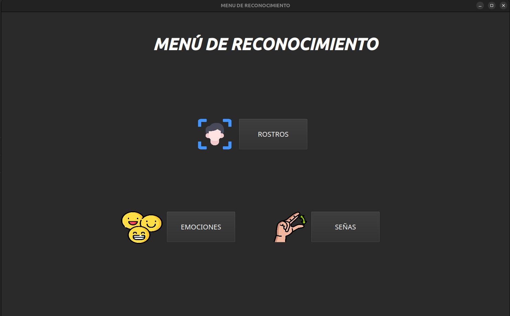
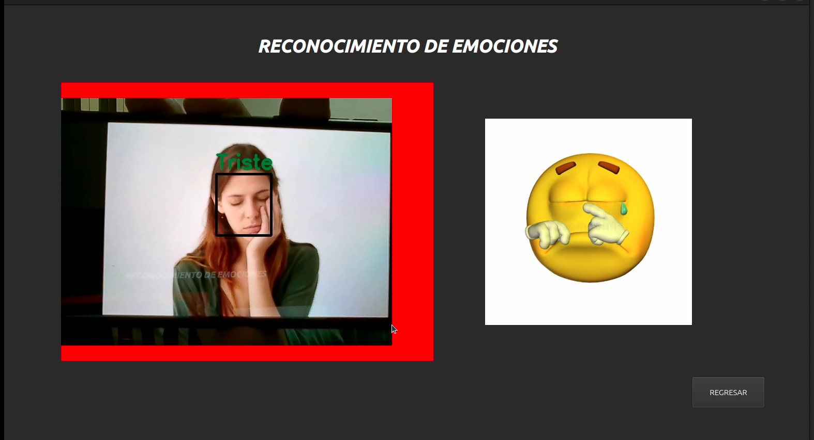
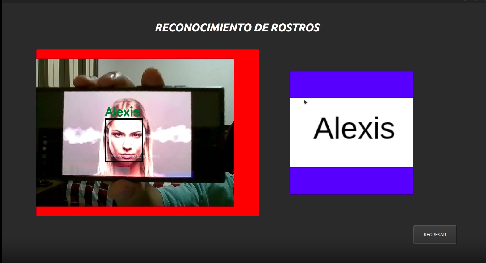
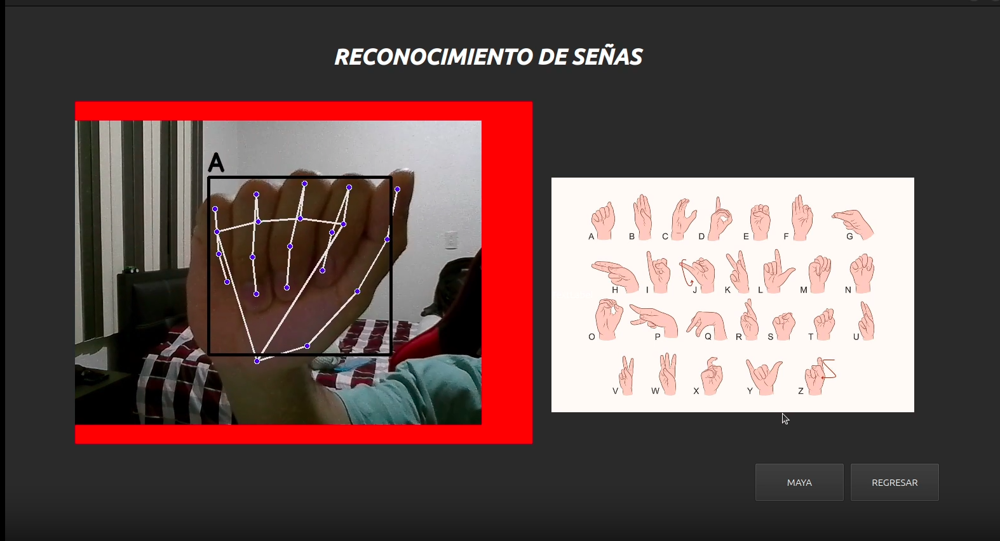

# APLICACIÓN DE RECONOCIMIENTO POR MEDIO DE MEDIAPIPE

Proyecto realizado el `4 de agosto del 2024`, el cual consiste en un aplicación que tiene tres métodos de reconocimiento. 

1. Señas: reconoce las letras en el lenguaje de señas. 

2. Rostros: Reconoce la persona que se ponga en frente de la cámara, cabe resaltar que se intercambiaron las imagenes reales por solo nombres, ya que originalmente se trataba de reconocer a compañeros de clase.

3. Emociones: Reconoce cuatro emociones, enojo, felicidad, sorpresa y tristeza.

El proyecto originalmente fue desarrollado en `Windows 11`, por lo que se tuvo que migrar a `Ubuntu 24.04` para poder subirlo a github. Debido a la migración, ocurrieron algunas desalineaciones dentro de la aplicación.

Por otro lado, solo se comparte la aplicación en sí, los modelos fueron entrenados con `Scikit-learn`, utilizando alrededor de 2000 imágenes para la aplicación entera.

Los archivos `*.p` son los modelos entrenados para el funcionamiento de la aplicación.

# DEMOSTRACIONES

De manera general se muestra cada función de la aplicación, sin embargo, una demostración completa la puede encontrar danto [Clic aquí](https://drive.google.com/file/d/1a1vLbW6T45BuAmfZvcLUw5Lt28-7ipIf/view?usp=sharing).

### Página principal

### Reconocimiento de emociones

### Reconocimiento de rostros

### Reconocimiento de señas

